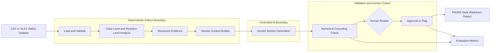
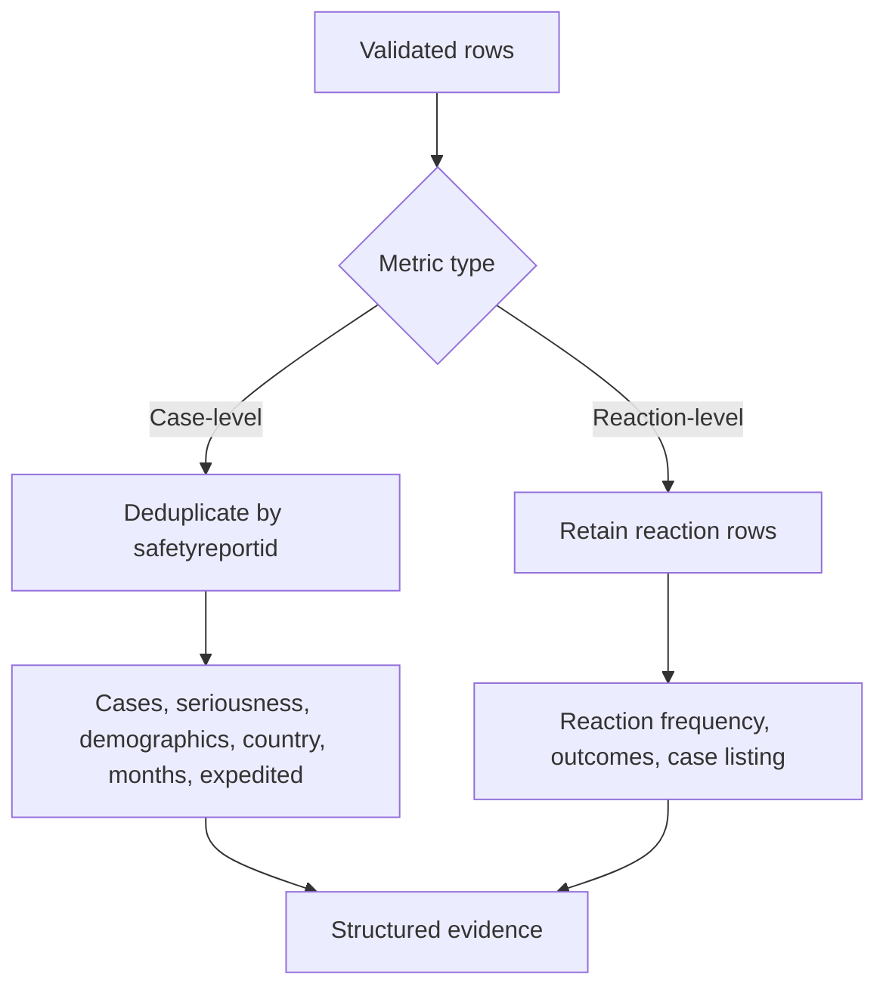

# Architecture

## System flow



## Component responsibilities

| Component | Responsibility | Trust boundary |
| --- | --- | --- |
| `data_loader.py` | Load XLSX/CSV, validate required fields, parse dates | Deterministic |
| `analysis.py` | Deduplicate cases, calculate metrics, build evidence and listing | Deterministic |
| `context_builder.py` | Select relevant evidence and fill section prompts | Deterministic |
| `llm_client.py` | Call one configured Gemini model with conservative settings | AI |
| `grounding_check.py` | Compare generated numerical claims with supplied evidence | Deterministic control |
| `review.py` | Require explicit approval or flagging | Human control |
| `report_generator.py` | Assemble Markdown and compute evaluation metrics | Deterministic |
| `main.py` | Coordinate the CLI workflow | Orchestration |

## Counting boundary



Gemini receives structured evidence rather than the spreadsheet. It is therefore downstream of all factual calculation and cannot become the source of record for counts or percentages.

## Finalization rule

```text
final section = generated text
                AND grounding status PASS
                AND human approval
```

If generation fails, numerical grounding flags a claim, or a reviewer rejects a section, the report marks it as not finalized.
